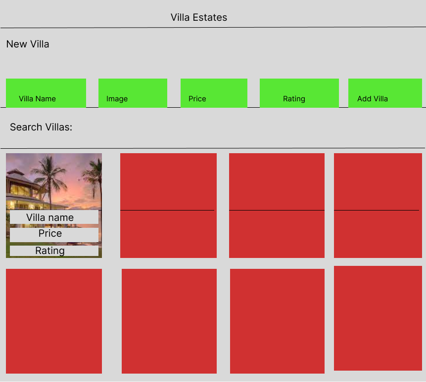
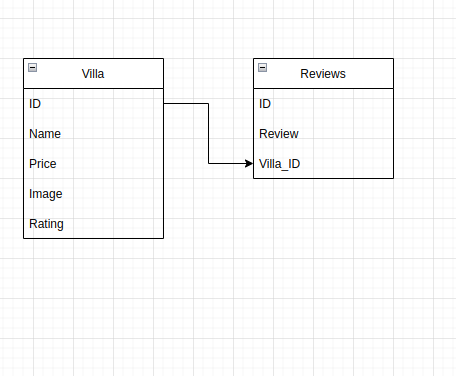

# Real Estate Project

## By Bryan Bosire

### Landing Page


### Entity Relationship Diagram


### Live Link

---

\- Click this link to see the live website [RealEstate](https://real-estate-projec.herokuapp.com/)

## Description

This project is scaffolded so that you can build a React frontend and Rails
backend together, and easily deploy them to Heroku.

## Requirements

- Ruby 2.7.4
- NodeJS (v16), and npm
- Heroku CLI
- Postgresql

See Environment Setup below for instructions on installing these tools if you
don't already have them.

## Setup

Start by **cloning** (not forking) the project template repository and removing
the remote:

```console
$ git clone git@github.com:Finyasy/real-estate-project.git

```

When you're ready to start building your project, run:

```sh
bundle install
rails db:create
npm install --prefix client
```

You can use the following commands to run the application:

- `rails s`: run the backend on [http://localhost:3000](http://localhost:3000)
- `npm start --prefix client`: run the frontend on
  [http://localhost:4000](http://localhost:4000)

Make sure to also update this README to include documentation about
your project. Here's a list of some [awesome readmes][] for inspiration.

[awesome readmes]: https://github.com/matiassingers/awesome-readme

## Deploying

If you've already set up your environment to deploy to Heroku, you can run the
commands below to deploy your application. If not, make sure to check out the
Environment Setup section below.

To deploy, first log in to your Heroku account using the Heroku CLI:

```sh
heroku login
```

Create the new Heroku app:

```sh
heroku create my-app-name
```

Add the buildpacks for Heroku to build the React app on Node and run the Rails
app on Ruby:

```sh
heroku buildpacks:add heroku/nodejs --index 1
heroku buildpacks:add heroku/ruby --index 2
```

To deploy, commit your code and push the changes to Heroku:

```sh
git add .
git commit -m 'Commit message'
git push heroku main
```

> Note: depending on your Git configuration, your default branch might be named
> `master` or `main`. You can verify which by running
> `git branch --show-current`. If it's `master`, you'll need to run
> `git push heroku master` instead.

Any time you have changes to deploy, just make sure your changes are committed
on the main branch of your repo, and push those changes to Heroku to deploy
them.

You can view your deployed app with:

```sh
heroku open
```

## Environment Setup

### Install the Latest Ruby Version

Verify which version of Ruby you're running by entering this in the terminal:

```sh
ruby -v
```
If it's not, you can use `rvm` to install a newer version of Ruby:

```sh
rvm install 2.7.4 --default
```

You should also install the latest versions of `bundler` and `rails`:

```sh
gem install bundler
gem install rails
```

[supported runtimes]: https://devcenter.heroku.com/articles/ruby-support#supported-runtimes

### Install NodeJS

Verify you are running a recent version of Node with:

```sh
node -v
```

If your Node version is not 16.x.x, install it and set it as the current and
default version with:

```sh
nvm install 16
nvm use 16
nvm alias default 16
```

You can also update your npm version with:

```sh
npm i -g npm
```

### Sign Up for a [Heroku Account][heroku signup]

You can sign up at for a free account at
[https://signup.heroku.com/devcenter][heroku signup].

### Install Postgresql

Heroku requires that you use PostgreSQL for your database instead of SQLite.
PostgreSQL (or just Postgres for short) is an advanced database management
system with more features than SQLite. If you don't already have it installed,
you'll need to set it up.

#### PostgreSQL Installation for WSL

To install Postgres for WSL, run the following commands from your Ubuntu terminal:

```sh
sudo apt update
sudo apt install postgresql postgresql-contrib libpq-dev
```

Then confirm that Postgres was installed successfully:

```sh
psql --version
```

Run this command to start the Postgres service:

```sh
sudo service postgresql start
```

Finally, you'll also need to create a database user so that you are able to
connect to the database from Rails. First, check what your operating system
username is:

```sh
whoami
```

If your username is "ian", for example, you'd need to create a Postgres user
with that same name. To do so, run this command to open the Postgres CLI:

```sh
sudo -u postgres -i
```

From the Postgres CLI, run this command (replacing "ian" with your username):

```sh
createuser -sr ian
```

Then enter `control + d` or type `logout` to exit.

[This guide][postgresql wsl] has more info on setting up Postgres on WSL if you
get stuck.

[postgresql wsl]: https://docs.microsoft.com/en-us/windows/wsl/tutorials/wsl-database#install-postgresql

#### Postgresql Installation for OSX

To install Postgres for OSX, you can use Homebrew:

```sh
brew install postgresql
```

Once Postgres has been installed, run this command to start the Postgres
service:

```sh
brew services start postgresql
```

## Troubleshooting

If you ran into any errors along the way, here are some things you can try to
troubleshoot:

- If you are getting the error message when trying to deploy to heroku about not suppoting ruby 2.7.4, Run this in your terminal
```sh
heroku stack:set heroku-20
```

For additional support, check out these guides on Heroku:

- [Deploying a Rails 6 App to Heroku][heroku rails deploying guide]
- [Rails Troubleshooting on Heroku][troubleshooting guide on heroku]

[postgres downloads page]: https://postgresapp.com/downloads.html
[heroku rails deploying guide]: https://devcenter.heroku.com/articles/getting-started-with-rails6
[troubleshooting guide on heroku]: https://devcenter.heroku.com/articles/getting-started-with-rails6#troubleshooting

## License

---

MIT License

Copyright (c) [2022] [Bryan Bosire]
# phase444
